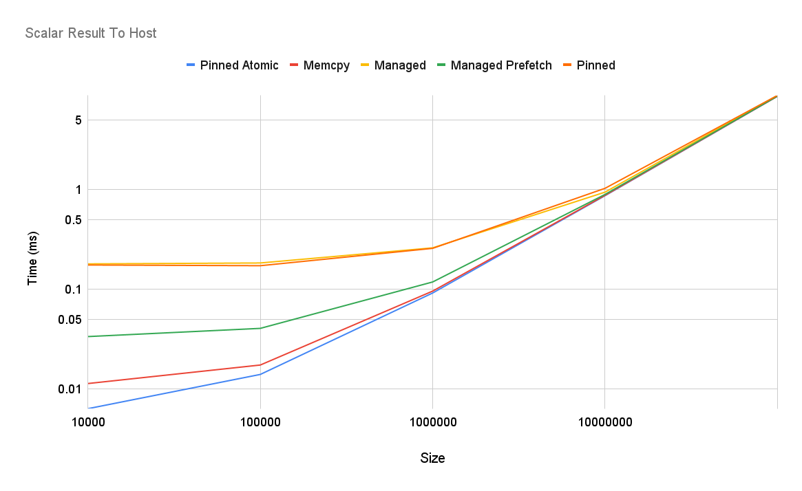

# cuda_scalar_result
Answering "What is the fastest way to return a single scalar from a kernel to host?" 

# Result

- CUDA Version: 11.2
- GPU: Quadro GV100
- Driver: 460.32.03
- CPU: Intel(R) Core(TM) i9-7900X CPU @ 3.30GHz

